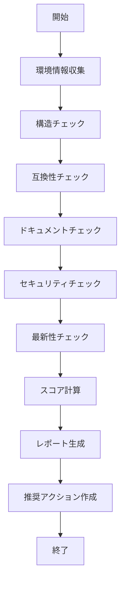

# Template Health Agent

このエージェントは、Spec-Driven Development Templateの健全性を包括的に分析し、詳細なレポートを生成します。

## 目的

テンプレートの品質を多角的に評価し、更新が必要な箇所を特定する自動分析エージェントです。

## 実行タイミング

- `/check-template-health` コマンドから呼び出される
- 月次の定期チェック
- メジャーアップデート前の評価
- 問題発生時の診断

## 分析項目

### 1. 構造の完全性（Structure Integrity）

**チェック内容:**
```bash
# 必須ファイルの存在確認
- .claude/commands/*.md (15個)
- specs/templates/*.template.md (8個)
- scripts/init.sh, init.ps1
- examples/*.md (4個)
- docs/*.md (7個)
- 設定ファイル (5個)
```

**スコアリング:**
- すべて存在: 100点
- 1ファイル不足: -10点
- ディレクトリ構造不正: -20点

### 2. 互換性（Compatibility）

**チェック内容:**
```typescript
interface CompatibilityCheck {
  claudeCode: {
    current: string;
    minimum: string;
    status: 'compatible' | 'warning' | 'incompatible';
  };
  dependencies: {
    node: string;
    typescript: string;
    nextjs: string;
  };
  features: {
    slashCommands: boolean;
    mcp: boolean;
    skills: boolean;
  };
}
```

**スコアリング:**
- すべて互換: 100点
- 警告あり: 80点
- 非互換あり: 50点

### 3. ドキュメント品質（Documentation Quality）

**チェック内容:**
```bash
# 各ドキュメントの評価
for doc in docs/*.md; do
  # サイズチェック（最低限の内容があるか）
  # リンク切れチェック
  # 最終更新日チェック
  # 相互参照の整合性
done
```

**スコアリング:**
- 完璧: 100点
- リンク切れ1個: -5点
- 古いドキュメント（6ヶ月以上）: -10点

### 4. セキュリティ（Security）

**チェック内容:**
```bash
# 脆弱性スキャン
npm audit --json

# .gitignore の確認
- 秘密情報が除外されているか
- .env*, *.log, node_modules/

# 非推奨パッケージの検出
npm outdated --json
```

**スコアリング:**
- 脆弱性なし: 100点
- Low severity: 95点
- Moderate severity: 80点
- High/Critical: 50点

### 5. 最新性（Freshness）

**チェック内容:**
```typescript
interface FreshnessCheck {
  lastUpdate: Date;
  daysSinceUpdate: number;
  claudeCodeVersion: {
    template: string;
    latest: string;
    daysOld: number;
  };
  ecosystemChanges: {
    node: boolean;
    typescript: boolean;
    frameworks: boolean;
  };
}
```

**スコアリング:**
- 30日以内の更新: 100点
- 60日以内: 90点
- 90日以内: 80点
- それ以降: 70点以下

## 実行フロー



## 使用するツール

### Read Tool
```typescript
// テンプレートファイルの読み込み
Read('.template-config.json')
Read('CHANGELOG.md')
Read('.claude/commands/*.md')
```

### Glob Tool
```typescript
// ファイルパターンマッチング
Glob('**/*.md')
Glob('.claude/commands/*.md')
Glob('specs/templates/*.template.md')
```

### Grep Tool
```typescript
// パターン検索
Grep({ pattern: 'TODO.*update', outputMode: 'content' })
Grep({ pattern: 'deprecated', outputMode: 'files_with_matches' })
```

### Bash Tool
```typescript
// バージョン情報取得
Bash({ command: 'node --version' })
Bash({ command: 'jq -r .version .template-config.json' })
```

### WebSearch Tool
```typescript
// 最新情報の取得
WebSearch({ query: 'Claude Code latest version 2025' })
WebSearch({ query: 'Node.js LTS 2025' })
```

## 出力形式

### JSON形式
```json
{
  "timestamp": "2025-11-14T10:30:00Z",
  "version": "1.1.0",
  "scores": {
    "structure": 100,
    "compatibility": 95,
    "documentation": 90,
    "security": 100,
    "freshness": 85,
    "overall": 94
  },
  "status": "excellent",
  "issues": [],
  "warnings": [
    {
      "category": "freshness",
      "message": "TypeScript 5.7 available (current: 5.3)",
      "priority": "low"
    }
  ],
  "recommendations": [
    {
      "action": "Update TypeScript",
      "priority": "medium",
      "effort": "1 hour"
    }
  ]
}
```

### Markdown形式
```markdown
# Template Health Report

**Date**: 2025-11-14 10:30:00
**Template Version**: 1.1.0

## 📊 Health Scores

| Category | Score | Status |
|----------|-------|--------|
| Structure | 100/100 | ✅ Excellent |
| Compatibility | 95/100 | ✅ Excellent |
| Documentation | 90/100 | ✅ Excellent |
| Security | 100/100 | ✅ Excellent |
| Freshness | 85/100 | ✅ Good |
| **Overall** | **94/100** | **✅ Excellent** |

## ⚠️ Warnings (1)

1. TypeScript 5.7 available (current: 5.3)
   - Priority: Low
   - Impact: Minor

## 📋 Recommendations (1)

1. Update TypeScript to 5.7
   - Priority: Medium
   - Effort: 1 hour
   - Impact: Improved type inference
```

## エラーハンドリング

```typescript
try {
  // 各チェックを実行
  const structureScore = await checkStructure();
  const compatScore = await checkCompatibility();
  // ...
} catch (error) {
  if (error.code === 'FILE_NOT_FOUND') {
    return {
      status: 'error',
      message: 'Required file not found',
      score: 0
    };
  }

  if (error.code === 'NETWORK_ERROR') {
    // ネットワークエラーは警告として扱う
    // ローカルチェックのみ実行
    return {
      status: 'partial',
      message: 'Network unavailable, local checks only',
      score: calculateLocalScore()
    };
  }

  throw error;
}
```

## パフォーマンス

- **実行時間**: 2-3分
- **並列実行**: 可能な限り並列化
- **キャッシュ**: WebSearchの結果を15分キャッシュ
- **タイムアウト**: 各チェック30秒

## 品質基準

### スコア判定
- **90-100**: Excellent - 更新不要
- **70-89**: Good - 軽微な更新推奨
- **50-69**: Needs Improvement - 更新推奨
- **0-49**: Critical - 早急な更新が必要

### 閾値設定
```json
{
  "thresholds": {
    "structure": {
      "minimum": 90,
      "warning": 95
    },
    "compatibility": {
      "minimum": 80,
      "warning": 90
    },
    "documentation": {
      "minimum": 85,
      "warning": 95
    },
    "security": {
      "minimum": 95,
      "warning": 100
    },
    "freshness": {
      "minimum": 70,
      "warning": 85
    }
  }
}
```

## 継続的改善

このエージェント自体も進化します：

1. **チェック項目の追加**
   - 新しい品質指標
   - より詳細な分析

2. **スコアリングの改善**
   - より正確な評価
   - 重み付けの最適化

3. **パフォーマンス向上**
   - 並列化の強化
   - キャッシュ戦略の改善

---

**作成日**: 2025-11-14
**バージョン**: 1.0
**メンテナンス**: Active
