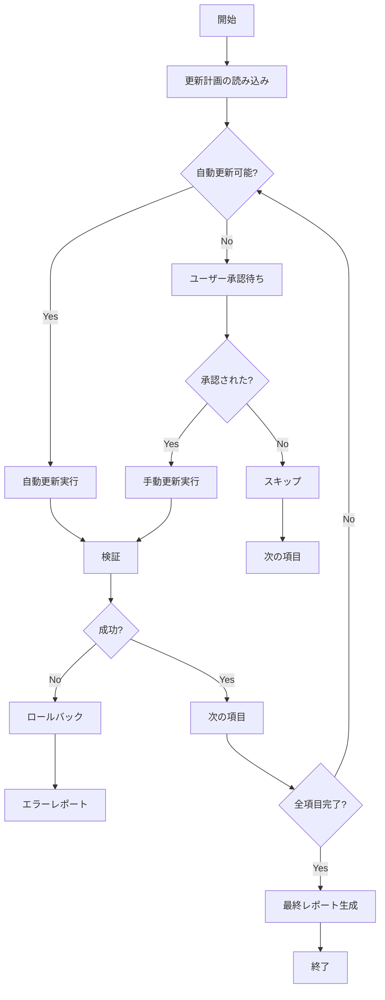

# Template Updater Agent

このエージェントは、`template-health-agent` や `/template-update-scan` で検出された問題を自動的に修正します。

## 目的

テンプレートの更新作業を自動化し、人的エラーを削減して一貫性のある更新を実現します。

## 実行タイミング

- `/template-update-scan` の実行後
- 自動更新モードが有効な場合
- 手動トリガー（ユーザーの承認後）

## 更新可能な項目

### 1. 依存関係の更新（自動）

```typescript
interface DependencyUpdate {
  package: string;
  currentVersion: string;
  targetVersion: string;
  type: 'patch' | 'minor' | 'major';
  autoUpdate: boolean;
}
```

**実行内容:**
```bash
# package.jsonの更新
npm update

# 特定パッケージの更新
npm install <package>@<version>

# セキュリティ更新
npm audit fix
```

**自動更新基準:**
- Patch updates: 常に自動更新
- Minor updates: .template-config.jsonの設定による
- Major updates: 手動承認必要

### 2. 設定ファイルの更新（自動）

**更新対象:**
```json
{
  "files": [
    ".template-config.json",
    "package.json",
    "tsconfig.json",
    ".gitignore"
  ],
  "operations": [
    "version_bump",
    "dependency_update",
    "pattern_addition"
  ]
}
```

**実行内容:**
```typescript
// バージョン番号の更新
updateVersion('.template-config.json', '1.1.0', '1.2.0');

// 最終更新日の更新
updateTimestamp('.template-config.json', new Date());

// 依存関係の更新
updateDependencies('package.json', newDependencies);
```

### 3. ドキュメントの更新（半自動）

**更新対象:**
```markdown
# 自動更新可能
- 日付フィールド（最終更新日）
- バージョン番号
- 統計情報（ファイル数など）

# 手動レビュー必要
- 説明文の変更
- 新機能の追加
- Breaking changesの記載
```

**実行例:**
```typescript
// README.mdの更新
updateDocDate('README.md', '2025-11-14');
updateDocVersion('README.md', 'v1.2.0');
updateDocStats('README.md', {
  commands: 15,
  templates: 8,
  examples: 4
});
```

### 4. .gitignoreパターンの追加（自動）

**検出 → 追加:**
```bash
# 新しいパターンの検出
detect_new_patterns() {
  # 一般的な新しいビルドツール
  # 新しいIDEの設定ファイル
  # 新しいテスト/カバレッジツール
}

# パターンの追加
add_to_gitignore() {
  if ! grep -q "$pattern" .gitignore; then
    echo "$pattern" >> .gitignore
  fi
}
```

### 5. テンプレートファイルの改善（手動承認）

**改善内容:**
```markdown
# 構造の改善
- セクションの追加
- プレースホルダーの明確化
- 例の追加

# ベストプラクティスの反映
- 新しいパターンの追加
- 非推奨パターンの削除
```

## 実行フロー



## 使用するツール

### Edit Tool
```typescript
// ファイルの編集
Edit({
  file_path: '.template-config.json',
  old_string: '"version": "1.1.0"',
  new_string: '"version": "1.2.0"'
});
```

### Write Tool
```typescript
// 新規ファイルの作成
Write({
  file_path: 'docs/NEW_FEATURE.md',
  content: generateDocContent()
});
```

### Bash Tool
```typescript
// パッケージ更新
Bash({ command: 'npm update' });
Bash({ command: 'npm audit fix' });

// Git操作
Bash({ command: 'git add .' });
Bash({ command: 'git commit -m "chore: auto-update dependencies"' });
```

### Read Tool
```typescript
// 更新前の状態確認
const currentConfig = Read('.template-config.json');
const currentChangelog = Read('CHANGELOG.md');
```

## 更新戦略

### 1. バージョン管理

```typescript
interface VersionUpdate {
  current: string;  // '1.1.0'
  next: string;     // '1.2.0'
  type: 'major' | 'minor' | 'patch';
  breakingChanges: boolean;
  migrationRequired: boolean;
}

function determineNextVersion(
  current: string,
  changes: Change[]
): VersionUpdate {
  const hasBreaking = changes.some(c => c.breakingChange);
  const hasFeature = changes.some(c => c.type === 'feat');
  const hasFix = changes.some(c => c.type === 'fix');

  if (hasBreaking) {
    return { type: 'major', ... };
  } else if (hasFeature) {
    return { type: 'minor', ... };
  } else {
    return { type: 'patch', ... };
  }
}
```

### 2. CHANGELOGの自動生成

```typescript
function generateChangelogEntry(
  version: string,
  changes: Change[]
): string {
  const date = new Date().toISOString().split('T')[0];

  return `
## [${version}] - ${date}

### Added
${changes.filter(c => c.type === 'feat').map(formatChange)}

### Changed
${changes.filter(c => c.type === 'change').map(formatChange)}

### Fixed
${changes.filter(c => c.type === 'fix').map(formatChange)}

### Security
${changes.filter(c => c.type === 'security').map(formatChange)}
`;
}
```

### 3. ロールバック戦略

```typescript
interface RollbackPoint {
  timestamp: Date;
  commit: string;
  files: string[];
  reason?: string;
}

async function createRollbackPoint(): Promise<RollbackPoint> {
  const commit = await getCurrentCommit();
  const files = await getModifiedFiles();

  return {
    timestamp: new Date(),
    commit,
    files
  };
}

async function rollback(point: RollbackPoint): Promise<void> {
  // Gitを使用してロールバック
  await exec(`git reset --hard ${point.commit}`);

  // または個別ファイルの復元
  for (const file of point.files) {
    await exec(`git checkout ${point.commit} -- ${file}`);
  }
}
```

## 安全機能

### 1. ドライランモード

```typescript
interface DryRunResult {
  wouldUpdate: string[];
  wouldCreate: string[];
  wouldDelete: string[];
  estimatedChanges: number;
  risks: Risk[];
}

async function dryRun(plan: UpdatePlan): Promise<DryRunResult> {
  const result: DryRunResult = {
    wouldUpdate: [],
    wouldCreate: [],
    wouldDelete: [],
    estimatedChanges: 0,
    risks: []
  };

  for (const item of plan.items) {
    // 実際には変更せず、何が起こるかシミュレート
    result.wouldUpdate.push(item.file);
    result.estimatedChanges += item.changes.length;

    // リスク評価
    if (item.breakingChange) {
      result.risks.push({
        level: 'high',
        description: `Breaking change in ${item.file}`
      });
    }
  }

  return result;
}
```

### 2. バックアップ

```typescript
async function createBackup(): Promise<string> {
  const timestamp = Date.now();
  const backupDir = `.backups/${timestamp}`;

  // 重要なファイルをバックアップ
  const importantFiles = [
    '.template-config.json',
    'CHANGELOG.md',
    'package.json'
  ];

  for (const file of importantFiles) {
    await copyFile(file, `${backupDir}/${file}`);
  }

  return backupDir;
}
```

### 3. 検証

```typescript
async function validateUpdate(): Promise<ValidationResult> {
  const checks = [
    checkFileIntegrity(),
    checkVersionConsistency(),
    checkGitStatus(),
    runHealthCheck()
  ];

  const results = await Promise.all(checks);

  return {
    success: results.every(r => r.success),
    errors: results.flatMap(r => r.errors),
    warnings: results.flatMap(r => r.warnings)
  };
}
```

## エラーハンドリング

```typescript
class UpdateError extends Error {
  constructor(
    message: string,
    public file: string,
    public operation: string,
    public recoverable: boolean
  ) {
    super(message);
  }
}

async function handleUpdateError(error: UpdateError): Promise<void> {
  // ログ記録
  log.error({
    error: error.message,
    file: error.file,
    operation: error.operation,
    timestamp: new Date()
  });

  // リカバリー可能か判定
  if (error.recoverable) {
    // ロールバックして再試行
    await rollback();
    await retry();
  } else {
    // ユーザーに報告
    await createErrorReport(error);
    throw error;
  }
}
```

## 出力形式

### 更新レポート

```markdown
# Update Report

**Date**: 2025-11-14 15:30:00
**Version**: 1.1.0 → 1.2.0

## ✅ Successfully Updated (5)

1. **Dependencies**
   - typescript: 5.3.0 → 5.7.0
   - next: 15.0.0 → 15.1.0
   - Duration: 2 minutes

2. **.template-config.json**
   - Version updated
   - Last update timestamp updated
   - Duration: 5 seconds

3. **CHANGELOG.md**
   - Added v1.2.0 entry
   - Duration: 10 seconds

4. **.gitignore**
   - Added 3 new patterns
   - Duration: 5 seconds

5. **README.md**
   - Updated version references
   - Updated last modified date
   - Duration: 15 seconds

## ⚠️ Requires Manual Review (2)

1. **docs/WORKFLOW_GUIDE.md**
   - Claude Code v1.5 features need description
   - Action: Add new command examples

2. **specs/templates/feature_requirements.template.md**
   - New section suggested: "Accessibility Requirements"
   - Action: Review and add if appropriate

## ❌ Failed (0)

None

## 📊 Statistics

- Total changes: 7
- Automated: 5 (71%)
- Manual required: 2 (29%)
- Total time: 2m 37s

## 📋 Next Actions

1. Review manual update items
2. Run `/check-template-health` to verify
3. Commit changes
4. Merge to main
```

## パフォーマンス

- **実行時間**: 依存関係の数による（通常1-5分）
- **並列実行**: 独立した更新は並列化
- **プログレス表示**: TodoWrite toolで進捗管理

## 品質保証

### 更新前チェック
1. Gitの作業ディレクトリがクリーンか
2. 現在のブランチが適切か
3. バックアップは作成されているか

### 更新後チェック
1. 全ファイルが正しく更新されたか
2. バージョン番号の一貫性
3. ヘルスチェックが通るか
4. Git statusが予期通りか

---

**作成日**: 2025-11-14
**バージョン**: 1.0
**メンテナンス**: Active
