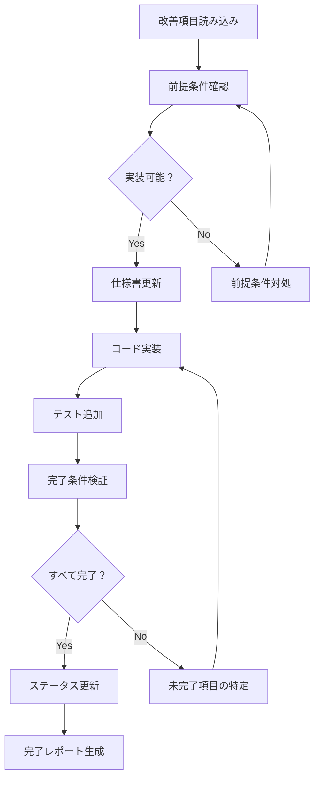

# /implement-improvements

レビューで指摘された個別の改善項目を段階的に実装するコマンド。

## 使用方法

```bash
# 特定の改善項目を実装
/implement-improvements [improvement-name]

# 例：暗号化キー管理の改善を実装
/implement-improvements encryption-key-management

# 例：レート制限の詳細実装
/implement-improvements rate-limiting-details
```

## タスク

1. **改善項目ファイルの読み込み**
   - `/specs/improvements/{priority}/{improvement-name}.md` から詳細を読み込み
   - メタデータ（優先度、担当、期限）を確認

2. **実装前チェック**
   ```markdown
   ## 実装前確認

   ### 改善項目: 環境依存の暗号化キー管理強化
   - **優先度**: 🟡 Important
   - **期限**: 実装開始前
   - **影響範囲**: セキュリティ、運用

   ### 前提条件
   - [ ] Technical仕様書の該当セクションを確認
   - [ ] Implementation仕様書の該当フェーズを確認
   - [ ] 関連する既存コードを確認
   ```

3. **段階的実装**

   **Step 1: 仕様書の更新**
   - Technical仕様書に詳細を追加
   - Implementation仕様書に実装手順を追加

   **Step 2: コード実装**
   ```typescript
   // 改善項目ファイルから実装ガイドを読み込み
   const implementationGuide = await loadImplementationGuide(improvementName);

   // 各ステップを実行
   for (const step of implementationGuide.steps) {
     await executeStep(step);
     await verifyStep(step);
   }
   ```

   **Step 3: テスト追加**
   - 単体テストの追加
   - 統合テストの更新

4. **完了条件の検証**
   ```markdown
   ## 完了条件チェック

   - [x] シークレット管理サービスが選定されている
   - [x] キーローテーション手順が文書化されている
   - [x] 環境別のキー管理方法が明確化されている
   - [ ] セキュリティチームのレビュー承認
   ```

5. **ステータス更新**
   - 改善項目のステータスを `Completed` に更新
   - レビューファイルの対応状況を更新
   - 完了レポートの生成

## 実装フロー



## 改善項目の例

### 🟡 Important Issues

1. **encryption-key-management**
   - AWS Secrets Manager統合
   - キーローテーション実装
   - 環境別設定

2. **rate-limiting-details**
   - Redis ベースの制限実装
   - エンドポイント別設定
   - エラーハンドリング

### 🟢 Minor Issues

3. **success-metrics-monitoring**
   - 監視ツール選定
   - メトリクス設定

4. **admin-role-scope**
   - Phase 1 スコープ明確化
   - 権限マトリクス更新

## 関連コマンド

- `/review-actions` - レビューアクションの確認
- `/implement` - 機能全体の実装
- `/spec-check` - 仕様書の整合性確認