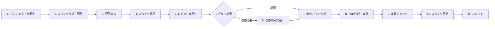

# Spec-Driven Development Workflow Guide

## 概要

このガイドでは、Enterprise AI Agent Platformにおけるスペック駆動開発ワークフローの実践的な使い方を説明します。

**11ステップのワークフロー（⭐ レビュー管理を含む）**:



**シンプル版**:
```
プロジェクト初期化 → スペック作成・調整 → 要件追加 → スペック確認 →
レビュー実行⭐ → 改善項目実装⭐ → 実装ガイド作成 → Todo作成・実装 →
実装チェック → スペック更新 → コミット
```

このワークフローに従うことで、**ドキュメント駆動、テスト駆動、品質重視**の開発が実現できます。

---

## 前提知識

### 使用可能なツール

#### スラッシュコマンド

##### プロジェクト管理
- `/init-project [project-name]` - プロジェクト初期化とスペック作成

##### スペックレビュー・品質管理（⭐ 新機能）
- `/review-specs [scope]` - スペックドキュメントの包括的レビュー
- `/review-actions [feature-name]` - レビューアクションアイテムの確認・管理
- `/adjust-specs [scope]` - スペックの対話的調整・改善

##### 機能開発
- `/add-requirements [feature-name]` - 新機能の要件定義ドキュメント作成
- `/add-technical [feature-name]` - 技術仕様ドキュメント作成
- `/add-implementation [feature-name]` - 実装ガイドドキュメント作成
- `/spec-check [feature-name]` - 仕様の一貫性検証

##### 実装・改善
- `/implement [feature-name]` - スペック駆動実装の実行（レビュー結果を自動参照）
- `/implement-improvements [improvement-name]` - 個別改善項目の段階的実装（⭐ 新機能）
- `/check-implementation [feature-name]` - 実装状況・品質ゲート確認

##### スペック更新・コミット
- `/update-specs [feature-name]` - スペックへの実装結果反映
- `/review [file-paths]` - コード品質・セキュリティレビュー
- `/commit-prep` - コミット前の品質チェック

#### スキル（再利用可能なガイド）
- `prisma-migration` - データベーススキーマ変更とマイグレーション
- `api-endpoint` - REST APIエンドポイント作成
- `test-generation` - ユニット・統合・E2Eテスト作成

#### Claude Codeツール
- `TodoWrite` - タスク管理
- `Read/Write/Edit` - ファイル操作
- `Bash` - コマンド実行

---

## 実践例：レポートコメント機能の実装

実際の開発フローを、具体的なコマンドと共に説明します。

---

## Step 1: 要件追加 (Add Requirements)

### 状況
ユーザーから以下の要望がありました：
> 「レポートに対してコメント機能を追加したい。上司は部下のレポートにコメントでき、本人も返信できるようにしたい」

### あなたの指示（方法1: スラッシュコマンド使用）

```bash
/add-requirements report-comments
```

このコマンドが自動的に以下を実行します：
1. ユーザーへの体系的なヒアリング（対象ユーザー、目的、機能、権限など）
2. **テンプレート使用**: `/specs/templates/feature_requirements.template.md` を基に要件定義ドキュメントを作成
3. `/specs/requirements/report-comments.md`への保存

**注**: テンプレートの全セクション（ドキュメント情報、概要、ビジネスコンテキスト、ユーザーストーリー、ロール定義、セキュリティ要件等）が保持され、プレースホルダーが実際の内容で置き換えられます。

### あなたの指示（方法2: 手動で依頼）

```
「レポートコメント機能の要件をまとめてください」
```

### Claude Codeの作業

要件定義ドキュメントを作成します。

**作成ファイル**: `/specs/requirements/report-comments.md`

**内容**:
```markdown
# Report Comments - Requirements

## Overview
レポートに対するコメント機能を追加し、上司と部下のコミュニケーションを促進する。

## User Stories

### US-1: コメント投稿
**As a** マネージャー
**I want to** 部下のレポートにコメントを追加したい
**So that** フィードバックを直接伝えられる

**Acceptance Criteria:**
- マネージャーは自分の部下のレポートにコメント可能
- コメントは即座に保存される
- コメント投稿者の名前と日時が表示される

### US-2: コメント返信
**As an** 従業員
**I want to** 自分のレポートに付いたコメントに返信したい
**So that** 上司とコミュニケーションできる

## Role Permissions
- EMPLOYEE: 自分のレポートのコメント閲覧・返信
- MANAGER: 部下のレポートへのコメント・閲覧
- ADMIN: 全レポートのコメント閲覧・管理
```

### アウトプット
✅ 要件定義ドキュメント作成完了

### 所要時間
30分 - 1時間

---

## Step 2: スペック確認 (Check Specifications)

### あなたの指示

```bash
/spec-check report-comments
```

### Claude Codeの動作

1. `/specs/requirements/report-comments.md` を読み込み
2. 既存のアーキテクチャ（`/docs/TECHNICAL_ARCHITECTURE.md`）との整合性チェック
3. 不足している情報を指摘
4. 技術的な懸念点を報告

### 出力例

```
=== Spec Check: report-comments ===

✅ Requirements Check
  ✅ User stories are well-defined
  ✅ Acceptance criteria are clear
  ✅ Role permissions specified

⚠️  Technical Specification Check
  ⚠️  Technical spec not found
  📝 Need to create: /specs/technical/report-comments.md

⚠️  Implementation Check
  ⚠️  Implementation guide not found
  📝 Need to create: /specs/implementation/report-comments.md

🔍 Architecture Impact Analysis
  ⚠️  Database schema changes required
      - New Comment model needed
      - Relation to Report model
      - Migration strategy undefined

  ⚠️  API endpoints required
      - POST /api/reports/:id/comments
      - GET /api/reports/:id/comments
      - PUT /api/comments/:id
      - DELETE /api/comments/:id

  ✅ Security considerations
      - Permission checks required (already have RBAC)
      - Input validation needed (Zod schemas)

📋 Recommended Next Steps:
1. Create technical specification
   - Define Comment Prisma model
   - Design API contracts
   - Specify permission logic
2. Create implementation guide
3. Re-run /spec-check to verify consistency
```

### この段階での作業

Claude Codeと協議しながら技術仕様を作成します。

**あなたの指示（自動）**:
```bash
/add-technical report-comments
```

**または手動で依頼**:
```
「report-commentsの技術仕様を作成してください」
```

**作成ファイル**: `/specs/technical/report-comments.md`

**内容**:
```markdown
# Report Comments - Technical Specification

## Database Schema

### Comment Model
```prisma
model Comment {
  id        String   @id @default(cuid())
  content   String   @db.Text
  reportId  String
  userId    String
  parentId  String?  // For threaded comments
  createdAt DateTime @default(now())
  updatedAt DateTime @updatedAt

  report Report @relation(fields: [reportId], references: [id], onDelete: Cascade)
  user   User   @relation(fields: [userId], references: [id], onDelete: Cascade)
  parent Comment? @relation("CommentThread", fields: [parentId], references: [id])
  replies Comment[] @relation("CommentThread")

  @@index([reportId])
  @@index([userId])
  @@index([parentId])
  @@map("comments")
}
```

## API Design

### POST /api/reports/:id/comments
Create a new comment

**Request**:
```json
{
  "content": "Great progress on this task!",
  "parentId": "optional-for-reply"
}
```

**Response**: 201 Created
```json
{
  "id": "comment-123",
  "content": "Great progress on this task!",
  "reportId": "report-456",
  "userId": "user-789",
  "createdAt": "2025-11-13T10:00:00Z"
}
```

## Permission Logic

```typescript
async function canComment(userId: string, reportId: string): boolean {
  // 1. Get report and user's role
  // 2. Check if user is report owner OR
  // 3. Check if user is manager/HR with access to report owner
  // 4. Return true/false
}
```
```

### アウトプット
✅ 技術仕様作成完了
✅ アーキテクチャとの整合性確認

### 所要時間
1-2時間

---

## Step 3: 実装内容ドキュメント化 (Document Implementation)

### あなたの指示

**自動コマンド**:
```bash
/add-implementation report-comments
```

**または手動で依頼**:
```
「report-commentsの実装ガイドを作成してください」
```

### Claude Codeの作業

技術仕様を実装可能な具体的なステップに分解します。

**作成ファイル**: `/specs/implementation/report-comments.md`

**内容**:
```markdown
# Report Comments - Implementation Guide

## Overview
This guide provides step-by-step instructions for implementing the comment functionality.

## Prerequisites
- Phase 1 (Multi-tenant auth) completed
- Report model exists in database

## Implementation Steps

### Step 1: Prisma Schema Update (30 minutes)

#### 1.1 Add Comment Model
Update `prisma/schema.prisma`:

```prisma
model Comment {
  id        String   @id @default(cuid())
  content   String   @db.Text
  reportId  String
  userId    String
  parentId  String?
  createdAt DateTime @default(now())
  updatedAt DateTime @updatedAt

  report  Report   @relation(fields: [reportId], references: [id], onDelete: Cascade)
  user    User     @relation(fields: [userId], references: [id], onDelete: Cascade)
  parent  Comment? @relation("CommentThread", fields: [parentId], references: [id])
  replies Comment[] @relation("CommentThread")

  @@index([reportId])
  @@index([userId])
  @@index([parentId])
  @@map("comments")
}
```

#### 1.2 Update Report Model
Add relation to Report model:

```prisma
model Report {
  // ... existing fields
  comments Comment[]
}
```

#### 1.3 Run Migration
```bash
npx prisma migrate dev --name add_comment_model
npx prisma generate
```

### Step 2: Create Zod Schemas (15 minutes)

**File**: `src/lib/schemas/comment.schema.ts`

```typescript
import { z } from 'zod';

export const createCommentSchema = z.object({
  content: z.string().min(1, 'Content is required').max(1000, 'Comment too long'),
  reportId: z.string().cuid(),
  parentId: z.string().cuid().optional(),
});

export const updateCommentSchema = z.object({
  content: z.string().min(1).max(1000),
});

export type CreateCommentInput = z.infer<typeof createCommentSchema>;
export type UpdateCommentInput = z.infer<typeof updateCommentSchema>;
```

### Step 3: Implement CommentService (1.5 hours)

**File**: `src/services/comment.service.ts`

[Detailed service implementation code...]

### Step 4: Create API Endpoints (1 hour)

**File**: `src/app/api/reports/[id]/comments/route.ts`

[Detailed API endpoint code...]

### Step 5: Create UI Components (2 hours)

**Files**:
- `src/components/CommentList.tsx`
- `src/components/CommentItem.tsx`
- `src/components/CommentForm.tsx`

[Detailed component code...]

### Step 6: Write Tests (1.5 hours)

**Files**:
- `src/services/comment.service.test.ts`
- `src/app/api/reports/[id]/comments/route.test.ts`
- `src/components/CommentList.test.tsx`

[Detailed test code...]

## Estimated Total Time: 6-7 hours

## Testing Checklist
- [ ] Manager can comment on subordinate's report
- [ ] Employee can reply to comments on their report
- [ ] Employee cannot comment on others' reports
- [ ] Comments display with author name and timestamp
- [ ] Threaded replies work correctly
```

### アウトプット
✅ 実装ガイド作成完了
✅ 推定時間算出完了

### 所要時間
1-2時間

---

## Step 4: Todo作成 (Create Todos)

### あなたの指示

```bash
/implement report-comments
```

### Claude Codeの動作

1. `/specs/implementation/report-comments.md` を読み込み
2. 実装ステップを細かいタスクに分解
3. TodoWriteツールで管理可能なタスクリストを作成
4. あなたに確認を求める

### 出力例

```
=== Implementation Plan: report-comments ===

Reading implementation guide...
✅ /specs/implementation/report-comments.md loaded

Creating detailed todos...

📋 Todo List (13 tasks):

Database & Schema (3 tasks)
1. [pending] Add Comment model to Prisma schema (Est: 15 min)
2. [pending] Update Report model with comments relation (Est: 5 min)
3. [pending] Run migration and regenerate Prisma Client (Est: 10 min)

Validation & Service Layer (4 tasks)
4. [pending] Create comment.schema.ts with Zod schemas (Est: 15 min)
5. [pending] Implement CommentService.create method (Est: 30 min)
6. [pending] Implement CommentService.findByReportId method (Est: 20 min)
7. [pending] Implement CommentService.checkPermission method (Est: 25 min)

API Endpoints (2 tasks)
8. [pending] Create POST /api/reports/[id]/comments endpoint (Est: 30 min)
9. [pending] Create GET /api/reports/[id]/comments endpoint (Est: 20 min)

UI Components (3 tasks)
10. [pending] Create CommentList component (Est: 45 min)
11. [pending] Create CommentItem component (Est: 30 min)
12. [pending] Create CommentForm component (Est: 45 min)

Testing (1 task)
13. [pending] Write unit and integration tests (Est: 1.5 hours)

📊 Summary:
- Total tasks: 13
- Estimated time: 6-7 hours
- Files to create: 8
- Files to modify: 2

📁 Files affected:
Modified:
  - prisma/schema.prisma
  - src/types/next-auth.d.ts (if needed)

Created:
  - prisma/migrations/xxx_add_comment_model/migration.sql
  - src/lib/schemas/comment.schema.ts
  - src/services/comment.service.ts
  - src/services/comment.service.test.ts
  - src/app/api/reports/[id]/comments/route.ts
  - src/app/api/reports/[id]/comments/route.test.ts
  - src/components/CommentList.tsx
  - src/components/CommentForm.tsx
  - src/components/CommentItem.tsx

⚠️  Prerequisites:
  ✅ Prisma is configured
  ✅ Report model exists
  ✅ Authentication system is working

Would you like to proceed with implementation? (yes/no/edit)
```

### あなたの返答

```
yes
```

### アウトプット
✅ Todoリスト作成完了
✅ 実装準備完了

### 所要時間
5-10分（自動）

---

## Step 5: 実装 (Implementation)

### Claude Codeの動作

TodoリストのタスクをTDD方式で1つずつ実装していきます。

### Task 1: Prismaスキーマ更新

**Claude Codeの作業**:

```typescript
// TodoWrite: Todo 1 を in_progress に変更

// prisma/schema.prisma を編集
model Comment {
  id        String   @id @default(cuid())
  content   String   @db.Text
  reportId  String
  userId    String
  parentId  String?
  createdAt DateTime @default(now())
  updatedAt DateTime @updatedAt

  report  Report   @relation(fields: [reportId], references: [id], onDelete: Cascade)
  user    User     @relation(fields: [userId], references: [id], onDelete: Cascade)
  parent  Comment? @relation("CommentThread", fields: [parentId], references: [id])
  replies Comment[] @relation("CommentThread")

  @@index([reportId])
  @@index([userId])
  @@index([parentId])
  @@map("comments")
}
```

**コンソール出力**:
```
[1/13] Adding Comment model to Prisma schema...
  ✅ Comment model added
  📝 Using skill: prisma-migration

[2/13] Updating Report model...
  ✅ Comments relation added to Report model

[3/13] Running migration...
  $ npx prisma migrate dev --name add_comment_model
  ✅ Migration created: 20251113_add_comment_model
  ✅ Prisma Client regenerated

TodoWrite: Tasks 1-3 marked as completed
```

### Task 4-7: サービス層実装（TDD方式）

**Claude Codeの作業**:

```typescript
// [4/13] Creating Zod schemas...

// src/lib/schemas/comment.schema.ts
import { z } from 'zod';

export const createCommentSchema = z.object({
  content: z.string().min(1).max(1000),
  reportId: z.string().cuid(),
  parentId: z.string().cuid().optional(),
});

// TodoWrite: Task 4 completed

// [5/13] Implementing CommentService.create...
// 📝 Using skill: api-endpoint

// First, write the test (TDD)
// src/services/comment.service.test.ts
describe('CommentService', () => {
  describe('create', () => {
    it('should create comment with valid data', async () => {
      // Test implementation
    });
  });
});

// Then implement the service
// src/services/comment.service.ts
export class CommentService {
  async create(data: CreateCommentInput, userId: string) {
    await this.checkPermission(data.reportId, userId);

    return prisma.comment.create({
      data: {
        content: data.content,
        reportId: data.reportId,
        userId,
        parentId: data.parentId,
      },
    });
  }
}

// Run test
$ npm run test src/services/comment.service.test.ts
✅ All tests passing

// TodoWrite: Task 5 completed
```

**コンソール出力**:
```
[4/13] Creating comment.schema.ts...
  ✅ Zod schemas created

[5/13] Implementing CommentService.create...
  📝 Writing tests first (TDD)
  ✅ Tests written
  ✅ Service method implemented
  $ npm run test src/services/comment.service.test.ts
  ✅ 3 tests passed

[6/13] Implementing CommentService.findByReportId...
  ✅ Method implemented
  ✅ Tests passing

[7/13] Implementing CommentService.checkPermission...
  ✅ Permission logic implemented
  ✅ Tests passing (edge cases covered)
```

### Task 8-9: APIエンドポイント

**Claude Codeの作業**:

```typescript
// [8/13] Creating POST endpoint...
// 📝 Using skill: api-endpoint

// src/app/api/reports/[id]/comments/route.ts
import { NextRequest, NextResponse } from 'next/server';
import { getServerSession } from 'next-auth';
import { CommentService } from '@/services/comment.service';

const service = new CommentService();

export async function POST(
  request: NextRequest,
  { params }: { params: { id: string } }
) {
  try {
    const session = await getServerSession(authOptions);
    if (!session?.user) {
      return NextResponse.json({ error: 'Unauthorized' }, { status: 401 });
    }

    const body = await request.json();
    const data = createCommentSchema.parse({
      ...body,
      reportId: params.id,
    });

    const comment = await service.create(data, session.user.id);
    return NextResponse.json(comment, { status: 201 });
  } catch (error) {
    return handleError(error);
  }
}
```

**コンソール出力**:
```
[8/13] Creating POST /api/reports/[id]/comments...
  ✅ Endpoint created
  ✅ Input validation added
  ✅ Error handling implemented
  $ npm run test src/app/api/reports/[id]/comments/route.test.ts
  ✅ 5 tests passed

[9/13] Creating GET /api/reports/[id]/comments...
  ✅ Endpoint created
  ✅ Pagination support added
  ✅ Tests passing
```

### Task 10-12: UIコンポーネント

**Claude Codeの作業**:

```typescript
// [10/13] Creating CommentList component...

// src/components/CommentList.tsx
'use client';

import { useEffect, useState } from 'react';
import { CommentItem } from './CommentItem';
import { CommentForm } from './CommentForm';

interface Comment {
  id: string;
  content: string;
  userId: string;
  userName: string;
  createdAt: string;
  replies: Comment[];
}

export function CommentList({ reportId }: { reportId: string }) {
  const [comments, setComments] = useState<Comment[]>([]);
  const [isLoading, setIsLoading] = useState(true);

  useEffect(() => {
    fetchComments();
  }, [reportId]);

  async function fetchComments() {
    const res = await fetch(`/api/reports/${reportId}/comments`);
    const data = await res.json();
    setComments(data);
    setIsLoading(false);
  }

  return (
    <div className="space-y-4">
      <CommentForm reportId={reportId} onSubmit={fetchComments} />
      {isLoading ? (
        <div>Loading...</div>
      ) : (
        comments.map((comment) => (
          <CommentItem key={comment.id} comment={comment} />
        ))
      )}
    </div>
  );
}
```

**コンソール出力**:
```
[10/13] Creating CommentList component...
  ✅ Component created
  ✅ Loading state handled
  ✅ Tests written
  $ npm run test src/components/CommentList.test.tsx
  ✅ 4 tests passed

[11/13] Creating CommentItem component...
  ✅ Component created with reply support
  ✅ Tests passing

[12/13] Creating CommentForm component...
  ✅ Form validation added
  ✅ Submit handler implemented
  ✅ Tests passing
```

### Task 13: テスト完成

**コンソール出力**:
```
[13/13] Completing test suite...
  ✅ Service unit tests: 8 tests
  ✅ API integration tests: 7 tests
  ✅ Component tests: 9 tests

$ npm run test
  ✅ All 24 tests passing
  ✅ Coverage: 87%

All todos completed! (13/13)
```

### 実装中の自動的な動作

**Claude Codeが各タスクで実行すること**:

1. タスクを `in_progress` にマーク
2. スキル（prisma-migration, api-endpoint, test-generation）を参照
3. TDD方式でテストを先に書く
4. 実装を行う
5. テストを実行して確認
6. タスクを `completed` にマーク
7. 次のタスクへ

### アウトプット
✅ 全13タスク完了
✅ 全テスト合格
✅ カバレッジ 87%

### 所要時間
6-7時間（実装ガイドの推定通り）

---

## Step 6: Todoチェック (Check Todos)

### あなたの確認

**自動コマンド**:
```bash
/check-implementation [feature-name]
```

**または手動で依頼**:
```
「実装状況を確認してください」
```

### Claude Codeの確認作業

```bash
# 1. Todo状態確認
TodoWrite status: All completed (13/13)

# 2. 全テスト実行
$ npm run test
✅ 24 tests passed
✅ Coverage: 87% (threshold: 80%)

# 3. 型チェック
$ npm run type-check
✅ No TypeScript errors

# 4. Linter
$ npm run lint
✅ No linting errors

# 5. Formatter確認
$ npm run format
✅ All files formatted
```

### 出力例

```
=== Implementation Status Check ===

✅ All Todos Completed (13/13)
  ✅ Database & Schema (3/3)
  ✅ Validation & Service (4/4)
  ✅ API Endpoints (2/2)
  ✅ UI Components (3/3)
  ✅ Testing (1/1)

✅ Quality Gates Passed
  ✅ Tests: 24 passed, 0 failed
  ✅ Coverage: 87% (target: 80%)
  ✅ TypeScript: No errors
  ✅ ESLint: No errors
  ✅ Prettier: All files formatted

📊 Test Breakdown:
  - Unit tests: 8 passed
  - Integration tests: 7 passed
  - Component tests: 9 passed

📁 Files Created/Modified:
  Modified (2):
    - prisma/schema.prisma
    - prisma/migrations/20251113_add_comment_model/migration.sql

  Created (9):
    - src/lib/schemas/comment.schema.ts
    - src/services/comment.service.ts
    - src/services/comment.service.test.ts
    - src/app/api/reports/[id]/comments/route.ts
    - src/app/api/reports/[id]/comments/route.test.ts
    - src/components/CommentList.tsx
    - src/components/CommentItem.tsx
    - src/components/CommentForm.tsx
    - src/components/CommentList.test.tsx

✅ Ready for spec update and commit
```

### アウトプット
✅ すべてのTodo完了確認
✅ 品質ゲート通過確認

### 所要時間
5分（自動）

---

## Step 7: スペック編集 (Edit Specs)

### あなたの指示

**自動コマンド**:
```bash
/update-specs [feature-name]
```

**または手動で依頼**:
```
「実装内容をスペックに反映してください」
```

### Claude Codeの作業

実装した内容と実装中の決定事項を仕様書に反映します。

### 7-1: 実装ガイドの更新

**ファイル**: `/specs/implementation/report-comments.md`

追記内容:

```markdown
## 実装完了情報

### 実装詳細
- **実装日**: 2025-11-13
- **実装者**: Claude Code + User
- **実装時間**: 6.5時間（推定: 7時間）
- **テストカバレッジ**: 87%

### ファイル一覧
**作成ファイル (9)**:
- src/lib/schemas/comment.schema.ts
- src/services/comment.service.ts
- src/services/comment.service.test.ts
- src/app/api/reports/[id]/comments/route.ts
- src/app/api/reports/[id]/comments/route.test.ts
- src/components/CommentList.tsx
- src/components/CommentItem.tsx
- src/components/CommentForm.tsx
- src/components/CommentList.test.tsx

**変更ファイル (2)**:
- prisma/schema.prisma (Comment model追加)
- prisma/migrations/20251113_add_comment_model/migration.sql

### 実装時の変更点

#### 追加機能: メンション機能
**変更内容**: コメント内で`@username`形式のメンション機能を追加

**理由**: 実装中にユーザーから「特定のユーザーに通知したい」という追加要望があった

**影響**:
- Comment modelに mentions フィールド追加（JSON型）
- 通知システムの必要性（Phase 3で実装予定）

**決定**: ADR 001として記録

#### パフォーマンス最適化
**変更内容**: コメント取得APIにページネーション実装

**理由**: 大量コメント時のパフォーマンス懸念

**影響**:
- GET /api/reports/:id/comments に `page`, `limit` パラメータ追加
- デフォルト: 20件/ページ

### 既知の問題
なし

### 今後の拡張案
1. リアルタイム通知機能（Phase 3）
2. コメント編集履歴（Phase 4）
3. コメント検索機能（Phase 5）

### テスト結果
```
Test Suites: 3 passed, 3 total
Tests:       24 passed, 24 total
Coverage:    87.3%
  - Statements: 88.1%
  - Branches: 85.2%
  - Functions: 89.7%
  - Lines: 87.9%
```

### 実装完了日
2025-11-13

### レビュー状況
- [ ] コードレビュー待ち
- [ ] セキュリティレビュー待ち
- [ ] パフォーマンステスト待ち
```

### 7-2: 決定事項の記録（ADR）

**ファイル**: `/specs/decisions/001-comment-mention-feature.md`

```markdown
# ADR 001: コメントにメンション機能を追加

## Status
Accepted

## Date
2025-11-13

## Context
レポートコメント機能の実装中、ユーザーから以下の要望があった：
- 「コメントで特定のユーザーに通知を送りたい」
- 「@usernameのようなメンション機能があると便利」

実装スケジュールには含まれていなかったが、ユーザビリティ向上のため検討した。

## Decision
`@username`形式のメンション機能を実装することを決定。

### 技術的実装
- Comment modelに `mentions` フィールド追加（JSON型）
- メンション解析ロジックをCommentServiceに追加
- UIでメンション部分をハイライト表示

### 実装範囲
**Phase 2（現在）で実装**:
- メンション構文の解析
- mentions フィールドへの保存
- UI上でのハイライト表示

**Phase 3で実装予定**:
- メンション時の通知送信
- メンション一覧表示

## Consequences

### Positive
- ユーザビリティ向上
- 将来の通知機能との統合が容易
- ユーザー要望に即座に対応できた

### Negative
- 実装時間が30分増加（6.5時間 → 7時間）
- 通知システムが完成するまで機能が不完全
- データベースマイグレーションが追加で必要

### Neutral
- テストケースが3つ増加
- API仕様に mentions フィールドが追加

## Alternatives Considered

### Option 1: Phase 3まで延期
- メリット: スケジュール通り
- デメリット: ユーザー要望に応えられない

### Option 2: 完全な通知機能まで実装
- メリット: 完全な機能提供
- デメリット: 実装時間が大幅増加（+3時間）

### Option 3: 採用案（メンション構文のみ実装）
- メリット: ユーザー要望に応えつつ、スケジュール影響最小
- デメリット: 通知機能は別フェーズ

## Follow-up Actions
- [ ] Phase 3で通知システム実装時にメンション通知を追加
- [ ] ユーザーにメンション機能の説明ドキュメント提供
- [ ] メンション機能のE2Eテスト追加（Phase 3）

## References
- Issue: #feature-report-comments
- Implementation: /specs/implementation/report-comments.md
- User Request: Slack conversation 2025-11-13
```

### 7-3: 技術仕様の更新

**ファイル**: `/specs/technical/report-comments.md`

追記内容:

```markdown
## 実装後の更新

### Comment Model（実際の実装）
```prisma
model Comment {
  id        String   @id @default(cuid())
  content   String   @db.Text
  reportId  String
  userId    String
  parentId  String?
  mentions  Json?    // 追加: メンション機能
  createdAt DateTime @default(now())
  updatedAt DateTime @updatedAt

  report  Report   @relation(fields: [reportId], references: [id], onDelete: Cascade)
  user    User     @relation(fields: [userId], references: [id], onDelete: Cascade)
  parent  Comment? @relation("CommentThread", fields: [parentId], references: [id])
  replies Comment[] @relation("CommentThread")

  @@index([reportId])
  @@index([userId])
  @@index([parentId])
  @@map("comments")
}
```

### API仕様の更新

#### GET /api/reports/:id/comments
ページネーション追加:

**Query Parameters**:
- `page`: ページ番号（デフォルト: 1）
- `limit`: 1ページあたりの件数（デフォルト: 20、最大: 100）

**Response**:
```json
{
  "items": [...],
  "pagination": {
    "page": 1,
    "limit": 20,
    "total": 50,
    "totalPages": 3
  }
}
```
```

### アウトプット
✅ 実装ガイド更新完了
✅ ADR作成完了
✅ 技術仕様更新完了

### 所要時間
15-30分

---

## Step 8: コミット (Commit)

### あなたの指示

```bash
/commit-prep
```

### Claude Codeの動作

コミット前の包括的なチェックとコミットメッセージの生成を行います。

### 8-1: コミット前チェック

```bash
=== Commit Preparation: report-comments ===

[1/7] Running tests...
$ npm run test
✅ All tests passing (24 passed, 0 failed)
✅ Coverage: 87.3% (threshold: 80%)

[2/7] Type checking...
$ npm run type-check
✅ No TypeScript errors

[3/7] Linting...
$ npm run lint
✅ No linting errors

[4/7] Code formatting...
$ npm run format
✅ All files formatted

[5/7] Checking spec updates...
✅ /specs/implementation/report-comments.md updated
✅ /specs/technical/report-comments.md updated
✅ /specs/decisions/001-comment-mention-feature.md created

[6/7] Verifying todos...
✅ All todos completed (13/13)

[7/7] Reviewing changed files...
$ git status
```

### 8-2: 変更ファイル確認

```bash
Modified files:
  M  prisma/schema.prisma
  M  specs/technical/report-comments.md
  M  specs/implementation/report-comments.md

New files:
  A  prisma/migrations/20251113_add_comment_model/migration.sql
  A  specs/decisions/001-comment-mention-feature.md
  A  src/lib/schemas/comment.schema.ts
  A  src/services/comment.service.ts
  A  src/services/comment.service.test.ts
  A  src/app/api/reports/[id]/comments/route.ts
  A  src/app/api/reports/[id]/comments/route.test.ts
  A  src/components/CommentList.tsx
  A  src/components/CommentItem.tsx
  A  src/components/CommentForm.tsx
  A  src/components/CommentList.test.tsx

Total: 3 modified, 11 new files
```

### 8-3: コミットメッセージ生成

```bash
=== Suggested Commit Message ===

[Feature] Add comment functionality to reports

- Add Comment model to Prisma schema with threaded reply support
- Implement CommentService with permission checks for RBAC
- Create API endpoints for comment CRUD operations with pagination
- Add CommentList, CommentItem, and CommentForm UI components
- Include mention feature (@username) per user request during implementation
- Add comprehensive test coverage (24 tests, 87% coverage)

Database Changes:
- New Comment model with relations to Report and User
- Support for threaded comments via parentId
- Mentions stored as JSON for future notification integration

API Endpoints:
- POST   /api/reports/:id/comments - Create comment
- GET    /api/reports/:id/comments - List comments (paginated)
- PUT    /api/comments/:id - Update comment
- DELETE /api/comments/:id - Delete comment

Specs Updated:
- Implementation guide updated with actual implementation details
- Technical spec updated with mention feature
- ADR 001 created for mention feature decision

Refs: #feature-report-comments
Specs: /specs/implementation/report-comments.md
ADR: /specs/decisions/001-comment-mention-feature.md
Tests: 24 new tests (87% coverage)
Time: 6.5 hours

=== Pre-commit Checklist ===

Quality Gates:
  ✅ Tests passing
  ✅ Types valid
  ✅ Linter passing
  ✅ Formatted
  ✅ Specs updated
  ✅ Todos completed
  ✅ No secrets exposed
  ✅ Documentation current

Security Checks:
  ✅ Input validation (Zod schemas)
  ✅ Authentication checks (getServerSession)
  ✅ Authorization checks (RBAC via CommentService)
  ✅ SQL injection protected (Prisma)
  ✅ XSS protection (React auto-escaping)

Performance:
  ✅ Database queries optimized
  ✅ Proper indexes on Comment model
  ✅ Pagination implemented

=== Ready to Commit ===

Options:
  yes   - Commit with generated message
  no    - Cancel commit
  edit  - Edit commit message before committing

Your choice:
```

### あなたの返答

```
yes
```

### 8-4: コミット実行

```bash
$ git add .

$ git commit -m "$(cat <<'EOF'
[Feature] Add comment functionality to reports

- Add Comment model to Prisma schema with threaded reply support
- Implement CommentService with permission checks for RBAC
- Create API endpoints for comment CRUD operations with pagination
- Add CommentList, CommentItem, and CommentForm UI components
- Include mention feature (@username) per user request during implementation
- Add comprehensive test coverage (24 tests, 87% coverage)

Database Changes:
- New Comment model with relations to Report and User
- Support for threaded comments via parentId
- Mentions stored as JSON for future notification integration

API Endpoints:
- POST   /api/reports/:id/comments - Create comment
- GET    /api/reports/:id/comments - List comments (paginated)
- PUT    /api/comments/:id - Update comment
- DELETE /api/comments/:id - Delete comment

Specs Updated:
- Implementation guide updated with actual implementation details
- Technical spec updated with mention feature
- ADR 001 created for mention feature decision

Refs: #feature-report-comments
Specs: /specs/implementation/report-comments.md
ADR: /specs/decisions/001-comment-mention-feature.md
Tests: 24 new tests (87% coverage)
Time: 6.5 hours
EOF
)"

[main a3f5d2c] [Feature] Add comment functionality to reports
 14 files changed, 892 insertions(+), 12 deletions(-)
 create mode 100644 prisma/migrations/20251113_add_comment_model/migration.sql
 create mode 100644 specs/decisions/001-comment-mention-feature.md
 create mode 100644 src/lib/schemas/comment.schema.ts
 create mode 100644 src/services/comment.service.ts
 create mode 100644 src/services/comment.service.test.ts
 create mode 100644 src/app/api/reports/[id]/comments/route.ts
 create mode 100644 src/app/api/reports/[id]/comments/route.test.ts
 create mode 100644 src/components/CommentList.tsx
 create mode 100644 src/components/CommentItem.tsx
 create mode 100644 src/components/CommentForm.tsx
 create mode 100644 src/components/CommentList.test.tsx

✅ Committed successfully
Commit hash: a3f5d2c
Branch: main
```

### アウトプット
✅ 品質ゲート通過
✅ コミット成功
✅ 1機能完成

### 所要時間
5分（自動）

---

## 🎉 1サイクル完了！

この時点で1つの機能（レポートコメント機能）が完全に実装され、次の要件に進むことができます。

---

## コマンド早見表

### 各ステップで使うコマンド

| Step | あなたの指示・コマンド | 自動/手動 | 所要時間 |
|------|---------------------|----------|---------|
| **1. 要件追加** | `/add-requirements [feature-name]` | 自動 | 5-10分 |
| | 「〇〇機能の要件をまとめて」 | 手動 | 30分-1時間 |
| **2. スペック確認** | `/spec-check [feature-name]` | 自動 | 5分 |
| **2. 技術仕様作成** | `/add-technical [feature-name]` | 自動 | 5-10分 |
| | 「技術仕様を作成して」 | 手動 | 1-2時間 |
| **3. 実装ドキュメント化** | `/add-implementation [feature-name]` | 自動 | 5-10分 |
| | 「実装ガイドを作成して」 | 手動 | 1-2時間 |
| **4. Todo作成** | `/implement [feature-name]` | 自動 | 5-10分 |
| **5. 実装** | （自動実行） | 自動 | 仕様による |
| **6. Todoチェック** | `/check-implementation [feature-name]` | 自動 | 2-5分 |
| | 「実装状況を確認して」 | 自動 | 2-5分 |
| **7. スペック編集** | `/update-specs [feature-name]` | 自動 | 5-10分 |
| | 「スペックに反映して」 | 手動 | 15-30分 |
| **8. コミット** | `/commit-prep` | 自動 | 5分 |

### コマンド詳細

#### `/add-requirements [feature-name]`
**用途**: 新機能の要件定義ドキュメントを作成

**使用タイミング**:
- 新機能の追加を開始する時
- ユーザーからの要望を整理する時
- 要件を体系的に文書化したい時

**動作**:
1. ユーザーへの体系的なヒアリング（対象ユーザー、目的、機能、権限）
2. **テンプレート**: `/specs/templates/feature_requirements.template.md` を使用
3. User Stories、Role Definitions、Security Requirements等を含む包括的なドキュメントを作成
4. `/specs/requirements/[feature-name].md`に保存

**出力内容**:
- User Stories with Acceptance Criteria
- Role Definitions（各役割のアクセス権限）
- Security Requirements
- Non-Functional Requirements
- Business Rules
- Dependencies
- Success Metrics

**例**:
```bash
/add-requirements report-comments
/add-requirements notification-system
```

#### `/spec-check [feature-name]`
**用途**: 仕様の一貫性と完全性をチェック

**使用タイミング**:
- 要件定義後
- 技術仕様作成後
- 実装ガイド作成後

**出力**:
- 仕様間の整合性チェック結果
- 不足している情報の指摘
- アーキテクチャ影響分析
- 次のステップの推奨

**例**:
```bash
/spec-check multi-tenant-auth
/spec-check report-comments
```

#### `/add-technical [feature-name]`
**用途**: 新機能の技術仕様ドキュメントを作成

**使用タイミング**:
- 要件定義が完了している
- `/spec-check`で要件の妥当性を確認済み
- 技術的なアーキテクチャを設計したい時

**前提条件**:
- `/specs/requirements/[feature-name].md`が存在すること
- 要件定義が完全であること

**動作**:
1. 要件定義ドキュメントを読み込み
2. 技術的なアプローチについてユーザーとの対話（アーキテクチャ、データモデル、API設計、セキュリティ）
3. **テンプレート**: `/specs/templates/feature_technical.template.md` を使用して技術仕様を作成
4. `/specs/technical/[feature-name].md`に保存

**出力内容**:
- Architecture Overview（システムアーキテクチャ、技術スタック）
- Data Models（Prismaスキーマ、リレーション、マイグレーション戦略）
- API Specification（エンドポイント、リクエスト/レスポンス、エラーコード）
- Frontend Architecture（コンポーネント構造、状態管理）
- Security Design（認証/認可、入力検証、監査ログ）
- Performance Considerations（DB最適化、キャッシング戦略）
- Testing Strategy（Unit/Integration/E2Eテスト）
- Error Handling（エラーレスポンス形式、エラーハンドリングパターン）
- Deployment Considerations（環境変数、マイグレーション、Feature Flags）

**例**:
```bash
/add-technical report-comments
/add-technical notification-system
```

**次のステップ**:
```bash
/spec-check [feature-name]  # 技術仕様の妥当性を確認
```

#### `/add-implementation [feature-name]`
**用途**: 新機能の実装ガイドドキュメントを作成

**使用タイミング**:
- 技術仕様が完了している
- `/spec-check`で技術仕様の妥当性を確認済み
- 実装の具体的な手順が必要な時

**前提条件**:
- `/specs/requirements/[feature-name].md`が存在すること
- `/specs/technical/[feature-name].md`が存在すること
- 要件定義と技術仕様が一貫していること

**動作**:
1. 要件定義と技術仕様ドキュメントを読み込み
2. 実装可能な具体的なステップに分解
3. **テンプレート**: `/specs/templates/feature_implementation.template.md` を使用して実装ガイドを作成
4. `/specs/implementation/[feature-name].md`に保存

**出力内容**:
- Prerequisites（必要なツール、環境構築手順、環境変数）
- Project Structure（ディレクトリ構造、ファイル配置）
- Implementation Phases（フェーズごとの実装手順）
  - Phase 1: Database & Data Models（Prismaスキーマ、マイグレーション、Repository/Validation）
  - Phase 2: Business Logic & API Layer（Service層、Server Actions）
  - Phase 3: Frontend Components（Pages、Client Components、Forms）
  - Phase 4: Testing & Documentation（Unit/Integration/E2Eテスト）
- Coding Standards（TypeScript、React、Error Handling、Database）
- Testing Strategy（テストカバレッジ目標、テスト種別）
- Deployment Checklist（デプロイ前チェック、デプロイ手順、デプロイ後確認）
- Troubleshooting（よくある問題と解決策）
- Performance Optimization（DBクエリ最適化、フロントエンド最適化）
- Monitoring & Logging（ログ戦略、パフォーマンスメトリクス）

**特徴**:
- 完全な動作コード例を含む
- 各フェーズごとに検証コマンドを提供
- TDD方式での実装を想定
- 実装時間の目安を記載

**例**:
```bash
/add-implementation report-comments
/add-implementation notification-system
```

**次のステップ**:
```bash
/spec-check [feature-name]  # 実装ガイドの妥当性を確認
/implement [feature-name]    # 実装を開始
```

#### `/implement [feature-name]`
**用途**: スペック駆動で実装を開始

**使用タイミング**:
- 実装ガイドが完成している
- Todo管理しながら実装したい
- TDD方式で進めたい

**動作**:
1. 実装ガイドを読み込み
2. 詳細なTodoリストを作成
3. 確認を求める
4. 承認後、TDD方式で実装開始

**例**:
```bash
/implement report-comments
```

#### `/review [file-paths]`
**用途**: コードレビュー（品質、セキュリティ、パフォーマンス）

**使用タイミング**:
- 実装完了後
- コミット前
- セキュリティチェックが必要
- パフォーマンス懸念がある

**チェック項目**:
- コード品質とスタイル
- セキュリティベストプラクティス
- パフォーマンス問題
- テストカバレッジ
- ドキュメント更新

**例**:
```bash
/review src/services/comment.service.ts,src/app/api/reports/[id]/comments/route.ts
/review  # 全ての変更をレビュー
```

#### `/check-implementation [feature-name]`
**用途**: 実装状況の確認と品質ゲートの実行

**使用タイミング**:
- 実装が完了した時
- 品質ゲートを通過しているか確認したい時
- コミット前の確認
- スペック更新前の確認

**前提条件**:
- 実装が完了していること（全TodoがCompletedまたは大部分が完了）

**チェック内容**:
1. Todo状態の確認（完了数/全体数）
2. 全テストの実行（Unit/Integration/E2E）
3. TypeScript型チェック
4. ESLint実行
5. Prettier確認
6. ファイル変更の分析
7. カバレッジ確認

**出力内容**:
- Todoステータスサマリー
- 品質ゲート結果（Pass/Fail）
- テスト内訳（Unit/Integration/E2E）
- ファイル変更一覧（作成/変更）
- カバレッジ指標
- 次のステップの推奨

**例**:
```bash
/check-implementation report-comments
/check-implementation  # 現在の実装をチェック
```

**または**:
```
「実装状況を確認してください」
```

**成功時の出力例**:
```
=== 実装状況チェック ===

✅ すべてのTodo完了 (13/13)
✅ テスト: 24 passed, 0 failed
✅ カバレッジ: 87% (目標: 80%)
✅ TypeScript: エラーなし
✅ ESLint: エラーなし
✅ Prettier: すべてフォーマット済み

次のステップ:
/update-specs report-comments
```

**失敗時の対応**:
- 失敗した品質ゲートを修正
- 再度コマンドを実行して確認

#### `/update-specs [feature-name]`
**用途**: 実装内容を仕様書に反映

**使用タイミング**:
- 実装完了後
- `/check-implementation`で品質ゲートが通過した後
- コミット前

**前提条件**:
- 実装が完了していること
- 品質ゲートが通過していること
- `/specs/requirements/[feature-name].md` が存在すること
- `/specs/technical/[feature-name].md` が存在すること
- `/specs/implementation/[feature-name].md` が存在すること

**実施内容**:
1. 実装の分析（ファイル変更、決定事項、追加機能）
2. 実装ガイドの更新
   - 実装完了情報の追加
   - ファイル一覧の記載
   - 実装時の決定事項の記録
   - テスト結果の記載
   - パフォーマンス指標の記載
3. 技術仕様の更新（必要に応じて）
   - データモデル変更の反映
   - API仕様の更新
   - エラーコードの追加
4. ADRの作成（重要な決定がある場合）
5. 一貫性の検証（`/spec-check` 実行）

**更新される内容**:
- **実装詳細**: 実装日時、実装時間、テストカバレッジ
- **ファイル一覧**: 作成/変更されたファイル
- **実装時の決定事項**: アーキテクチャ決定、設計変更、追加機能
- **既知の問題**: 制約、技術的負債、将来の改善点
- **テスト結果**: カバレッジ、テスト内訳
- **パフォーマンス指標**: APIレスポンスタイム、DBクエリ時間
- **セキュリティチェック**: 実装済みのセキュリティ対策
- **デプロイ準備**: 環境変数、マイグレーション、モニタリング
- **次のフェーズ**: Phase 2対応予定、技術的負債

**例**:
```bash
/update-specs report-comments
```

**または**:
```
「実装内容をスペックに反映してください」
```

**出力例**:
```
=== スペック更新完了 ===

✅ /specs/implementation/report-comments.md
   - 実装完了情報セクション追加
   - 決定事項2件記録
   - テスト結果記載

✅ /specs/technical/report-comments.md
   - API仕様更新（ページネーション追加）
   - エラーコード2件追加

✅ /docs/adr/ADR-005-comment-mentions.md
   - 新規作成

次のステップ:
/commit-prep
```

**重要な注意点**:
- 実装時の決定事項を正確に記録
- 元の仕様からの変更点を明確に文書化
- 将来のメンテナンスのために詳細を残す

#### `/commit-prep`
**用途**: コミット前の包括的なチェック

**使用タイミング**:
- **必ず毎回コミット前に実行**
- 品質ゲートを通過させたい

**チェック内容**:
1. 全テスト実行
2. TypeScript型チェック
3. ESLint実行
4. Prettier確認
5. スペック更新確認
6. Todo完了確認
7. セキュリティチェック
8. コミットメッセージ生成

**コミットメッセージについて**:
- Claude Code署名は含めません
- `🤖 Generated with Claude Code` は使用しません
- `Co-Authored-By: Claude` は使用しません
- シンプルで明確なコミットメッセージのみを生成します

**例**:
```bash
/commit-prep
```

---

## ワークフローのベストプラクティス

### 1. 要件定義は丁寧に

**Good**:
```markdown
## User Story
**As a** マネージャー
**I want to** 部下のレポートにコメントを追加したい
**So that** フィードバックを直接伝えられる

**Acceptance Criteria:**
- マネージャーは自分の部下のレポートにコメント可能
- コメントは即座に保存される
- コメント投稿者の名前と日時が表示される
```

**Bad**:
```markdown
コメント機能を追加する
```

### 2. スペック確認を早めに

実装前に`/spec-check`を実行して、仕様の不備を早期発見。

```bash
# 要件定義後すぐに実行
/spec-check feature-name

# 不足指摘を受けたら技術仕様を追加
「技術仕様を作成してください」

# 再度確認
/spec-check feature-name
```

### 3. 実装は小さく・頻繁に

大きな機能は段階的に実装：

```
Phase 1: 基本的なコメント投稿・表示
Phase 2: 返信機能
Phase 3: メンション機能
Phase 4: 編集・削除
```

### 4. TDD (Test-Driven Development)

実装時は必ずテストを先に書く：

```typescript
// ❌ Bad: 実装してからテスト
async create(data) { /* 実装 */ }
// 後でテスト書く

// ✅ Good: テスト駆動
// 1. テストを書く
it('should create comment', async () => {
  const result = await service.create(data);
  expect(result).toBeDefined();
});

// 2. 実装する
async create(data) { /* 実装 */ }

// 3. テスト実行
npm run test
```

### 5. コミットは小さく・意味のある単位で

**Good**:
```bash
# 機能ごとにコミット
git commit -m "[Feature] Add comment creation API"
git commit -m "[Feature] Add comment UI components"
git commit -m "[Test] Add comment service tests"
```

**Bad**:
```bash
# 全部まとめてコミット
git commit -m "Add comments"
```

### 6. ADRで決定を記録

実装中の重要な決定は必ずADR（Architecture Decision Record）に記録：

```markdown
# ADR 001: タイトル

## Status
Accepted / Rejected / Deprecated

## Context
なぜこの決定が必要だったか

## Decision
何を決定したか

## Consequences
決定の影響（Positive / Negative / Neutral）
```

### 7. スペックは生きたドキュメント

実装後は必ずスペックを更新：

```markdown
## 実装完了情報
- 実装日: 2025-11-13
- 実装時間: 6.5時間
- テストカバレッジ: 87%

## 実装時の変更点
- メンション機能を追加（ユーザー要望）
- ページネーション実装（パフォーマンス対策）
```

---

## トラブルシューティング

### Q1: `/spec-check`で多数のエラーが出る

**原因**: 仕様が不完全または矛盾している

**対処**:
1. エラーメッセージを1つずつ確認
2. 要件定義から見直す
3. 技術仕様を追加・修正
4. 再度`/spec-check`を実行

### Q2: `/implement`でTodoが多すぎる

**原因**: 機能が大きすぎる

**対処**:
1. 機能を小さく分割
2. MVPバージョンを先に実装
3. 拡張機能は別フェーズに

**例**:
```
# ❌ 大きすぎる
/implement advanced-comment-system

# ✅ 適切なサイズ
/implement basic-comment-posting
/implement comment-replies
/implement comment-mentions
```

### Q3: テストが失敗する

**原因**: 実装とテストの不一致

**対処**:
```bash
# 失敗したテストを確認
npm run test -- --reporter=verbose

# 該当ファイルのみテスト
npm run test src/services/comment.service.test.ts

# テストをデバッグモードで実行
npm run test:debug
```

### Q4: `/commit-prep`でエラー

**原因**: 品質ゲートを通過していない

**対処**:
1. エラーメッセージを確認
2. 該当する問題を修正
3. 再度`/commit-prep`を実行

**例**:
```bash
# 型エラーがある場合
npm run type-check
# エラーを修正

# Linterエラーがある場合
npm run lint
# エラーを修正

# テストが失敗している場合
npm run test
# テストを修正
```

### Q5: スペック更新を忘れた

**対処**:
```bash
# コミット前に必ず確認
/commit-prep

# スペック更新が必要と指摘される
「実装内容をスペックに反映してください」

# 再度コミット準備
/commit-prep
```

---

## レビュー管理の実践例（⭐ 新機能）

このセクションでは、新しいレビュー管理機能を使った実践的なワークフローを説明します。

### シナリオ: ユーザーAPIキー管理機能のレビューから実装まで

#### Step 1: スペックレビューの実行

スペック3種（Requirements, Technical, Implementation）を作成した後、レビューを実行します。

**あなたの指示**:
```bash
/review-specs user-api-key-management
```

**Claude Codeの動作**:
1. 3つのスペックドキュメントを包括的にレビュー
2. 各ドキュメントの品質スコアを算出
3. 問題を優先度別に分類（🔴 Critical、🟡 Important、🟢 Minor）
4. レビュー結果を保存

**出力例**:
```markdown
=== Spec Review: user-api-key-management ===

## 総合評価
📊 スコア: 92% (Approved with conditions)

## 詳細スコア
- Requirements: 95% (Excellent)
- Technical: 90% (Good)
- Implementation: 90% (Good)

## 検出された課題

### 🟡 Important (2項目)
1. 環境依存の暗号化キー管理強化
   - 期限: 実装開始前
   - 影響: セキュリティ、運用

2. レート制限の実装詳細化
   - 期限: Phase 3前
   - 影響: パフォーマンス、セキュリティ

### 🟢 Minor (5項目)
- Success Metrics測定環境の確定
- ADMINロールスコープの明確化
- エラーメッセージ多言語対応の詳細化
- APIキーマスキングルールの統一
- Approvalセクションの完成

## 次のステップ
1. /review-actions user-api-key-management で詳細確認
2. Important項目の対処を検討
3. /implement-improvements で個別実装、または
4. /implement でそのまま実装開始
```

**保存されるファイル**:
- `/specs/reviews/pending/user-api-key-management.md` - レビュー結果
- `/specs/improvements/important/encryption-key-management.md` - 改善項目詳細
- `/specs/improvements/important/rate-limiting-details.md` - 改善項目詳細
- `/specs/improvements/minor/index.md` - Minor項目一覧

#### Step 2: レビュー結果の確認

**あなたの指示**:
```bash
/review-actions user-api-key-management
```

**Claude Codeの動作**:
1. レビュー結果ファイルを読み込み
2. 改善項目を優先度順に表示
3. 各項目の期限と影響範囲を確認
4. 推奨アクションを提示

**出力例**:
```markdown
=== Review Actions: user-api-key-management ===

## レビューステータス
- 日付: 2025-11-15
- スコア: 92%
- 対応状況: ⏳ Pending

## 🟡 Important Issues (2項目)

### 1. 環境依存の暗号化キー管理強化
**期限**: 実装開始前（❗ 今すぐ対処推奨）
**影響範囲**: セキュリティ、運用
**詳細**: /specs/improvements/important/encryption-key-management.md

**概要**:
- AWS Secrets Managerの統合
- 環境別のキー管理戦略
- キーローテーション手順の文書化

**推奨アクション**:
```bash
/implement-improvements encryption-key-management
```

### 2. レート制限の実装詳細化
**期限**: Phase 3前
**影響範囲**: パフォーマンス、セキュリティ
**詳細**: /specs/improvements/important/rate-limiting-details.md

**概要**:
- Redisベースのスライディングウィンドウ実装
- エンドポイント別の制限設定
- エラーハンドリングとリトライロジック

**推奨アクション**:
Phase 2完了後に対処
```

## 🟢 Minor Issues (5項目)
詳細: /specs/improvements/minor/index.md

## 対処オプション
1. **今すぐ対処**: `/implement-improvements encryption-key-management`
2. **実装と並行**: `/implement user-api-key-management`（リスク管理が必要）
3. **詳細確認**: 改善項目ファイルを直接確認
```

#### Step 3: 重要な改善項目の実装

実装開始前に対処が必要な項目を先に実装します。

**あなたの指示**:
```bash
/implement-improvements encryption-key-management
```

**Claude Codeの動作**:
1. 改善項目ファイルを読み込み
2. 実装前チェックリストを表示
3. 段階的に実装（仕様更新 → コード実装 → テスト）
4. 完了条件を検証
5. ステータスを更新

**実装の流れ**:

**Phase 1: 仕様書の更新**
```bash
# Technical仕様書に追加
/specs/technical/user-api-key-management.md

## シークレット管理
### AWS Secrets Manager統合
- 環境変数: AWS_REGION, SECRETS_MANAGER_PREFIX
- シークレット名: {環境}/api-key-encryption
- キーローテーション: 90日ごと
```

**Phase 2: コード実装**
```typescript
// src/lib/secrets-manager.ts
import { SecretsManagerClient, GetSecretValueCommand } from '@aws-sdk/client-secrets-manager';

export class SecretsManager {
  private client: SecretsManagerClient;

  constructor() {
    this.client = new SecretsManagerClient({ region: process.env.AWS_REGION });
  }

  async getEncryptionKey(): Promise<string> {
    const command = new GetSecretValueCommand({
      SecretId: `${process.env.ENVIRONMENT}/api-key-encryption`
    });
    const response = await this.client.send(command);
    return response.SecretString!;
  }
}
```

**Phase 3: テスト追加**
```typescript
// src/lib/__tests__/secrets-manager.test.ts
describe('SecretsManager', () => {
  it('should retrieve encryption key from AWS Secrets Manager', async () => {
    const sm = new SecretsManager();
    const key = await sm.getEncryptionKey();
    expect(key).toBeDefined();
    expect(key.length).toBeGreaterThan(0);
  });
});
```

**完了確認**:
```markdown
## 完了条件チェック
- [x] AWS Secrets Manager統合コード実装
- [x] 環境別設定ドキュメント化
- [x] キーローテーション手順文書化
- [x] 単体テスト追加
- [ ] セキュリティチームレビュー（別途実施）

ステータス: ✅ 実装完了（レビュー待ち）
```

**コミット**:
```bash
git add .
git commit -m "feat: AWS Secrets Manager統合による暗号化キー管理強化

Addresses review improvement:
- Issue: encryption-key-management (Important)
- 環境別のシークレット管理を実装
- キーローテーション手順を文書化

Refs: /specs/reviews/pending/user-api-key-management.md
Refs: /specs/improvements/important/encryption-key-management.md"
```

#### Step 4: メイン機能の実装開始

改善項目を対処した後、メイン機能の実装を開始します。

**あなたの指示**:
```bash
/implement user-api-key-management
```

**Claude Codeの動作（Step 0: 新機能）**:
1. レビュー結果の存在を確認
2. 未対応のImportant項目を警告
3. ユーザーに対処確認

**出力例**:
```markdown
## ⚠️ レビュー結果が存在します

### スコア: 92% (Approved with conditions)

### 対処済み:
- ✅ 環境依存の暗号化キー管理強化 (encryption-key-management)

### 未対処項目:
- 🟡 レート制限の実装詳細化 (期限: Phase 3前)
  → Phase 2で対処予定のため、続行可能

### 対処方法:
1. そのまま実装を進める（Phase 3前に対処）
2. 今すぐ対処 → /implement-improvements rate-limiting-details
3. 詳細確認 → /review-actions user-api-key-management

続行しますか？
```

**あなたの応答**:
```
はい、Phase 3前に対処するので続行してください
```

**通常の実装フロー**:
- Step 1-10が実行される（Implementation Guideに従った実装）
- 各コミットにレビュー参照が含まれる

#### Step 5: Phase 3前の改善項目対処

Phase 3実装前にレート制限の詳細を実装します。

**あなたの指示**:
```bash
/implement-improvements rate-limiting-details
```

（実装プロセスはStep 3と同様）

#### Step 6: レビューの完了

すべての改善項目を対処したら、レビューを完了状態に移動します。

**手動操作**:
```bash
# 完了ファイルに移動
mv specs/reviews/pending/user-api-key-management.md \
   specs/reviews/completed/user-api-key-management.md

# 完了日を追記
echo "\n## 完了情報\n- 完了日: 2025-11-16\n- すべての改善項目対処済み" >> \
  specs/reviews/completed/user-api-key-management.md
```

### レビュー管理のベストプラクティス

1. **レビューファースト**: 実装前に必ず `/review-specs` を実行
2. **優先度順に対処**: 🔴 Critical → 🟡 Important → 🟢 Minor
3. **フェーズと同期**: 改善項目の期限と実装フェーズを合わせる
4. **コミットで参照**: 改善対処のコミットで必ずレビューファイルを参照
5. **定期的な棚卸し**: 完了した項目は `completed/` に移動

### メトリクスの活用

`/specs/reviews/index.md` で以下を追跡：
- 平均レビュースコア
- 改善項目対処率
- Critical Issue発生率
- レビュー→実装の平均時間

---

## まとめ

### ワークフローの鍵

1. **ドキュメントファースト**: 実装前に仕様を固める
2. **レビューファースト（⭐ 新）**: 実装前に必ず `/review-specs` でレビュー
3. **優先度管理（⭐ 新）**: Critical → Important → Minor の順で改善項目を対処
4. **小さく・頻繁に**: 大きな機能は分割して実装
5. **テスト駆動**: テストを先に書く
6. **品質重視**: `/commit-prep`で必ずチェック
7. **記録を残す**: ADRで決定を文書化、レビュー参照をコミットメッセージに含める
8. **スペック更新**: 実装後は必ず反映

### 成功の指標

✅ 仕様が明確で矛盾がない
✅ レビュースコア >90%（⭐ 新）
✅ Critical/Important改善項目がすべて対処済み（⭐ 新）
✅ テストカバレッジ >80%
✅ すべての品質ゲート通過
✅ コミットメッセージが詳細（レビュー参照を含む）
✅ ADRで決定が記録されている
✅ スペックが最新状態

### 次のステップ

このワークフローをマスターしたら：

1. Phase 1（マルチテナント認証）を実装
2. 他のフェーズに進む
3. チーム全体でワークフローを標準化
4. カスタムスキルを追加

---

**最終更新**: 2025-11-15
**バージョン**: 2.0（レビュー管理機能追加）
**ステータス**: 完成
